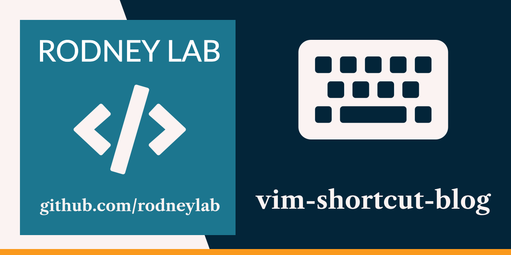

<p align="center">
  <a aria-label="Open Rodney Lab site" href="https://rodneylab.com" rel="nofollow noopener noreferrer">
    
  </a>
</p>
<h1 align="center">
  Vim Keyboard Shortcut Blog
</h1>

# vim-shortcut-blog

[](https://open.vscode.dev/rodneylab/vim-shortcut-blog)

Demo code for adding Vim Keyboard shortcuts for navigation on your dev blog site. The code accompanies the <a aria-label="Open Rodney Lab blog post on using uvu for Type script A P I testing" href="https://rodneylab.com/using-uvu-typescript-api-testing/">article on using Vim keyboard shortcuts on your blog</a>. If you have any questions, please drop a comment at the bottom of that page.

## Building and previewing the site

If you're seeing this, you've probably already done this step. Congrats!

```bash
git clone https://github.com/rodneylab/vim-shortcut-blog.git vim-shortcut-blog
cd vim-shortcut-blog
pnpm install # or npm install
pnpm run dev
```

## Building

```bash
pnpm run build
```

> You can preview the built app with `pnpm run preview`, regardless of whether you installed an adapter. This should _not_ be used to serve your app in production.
